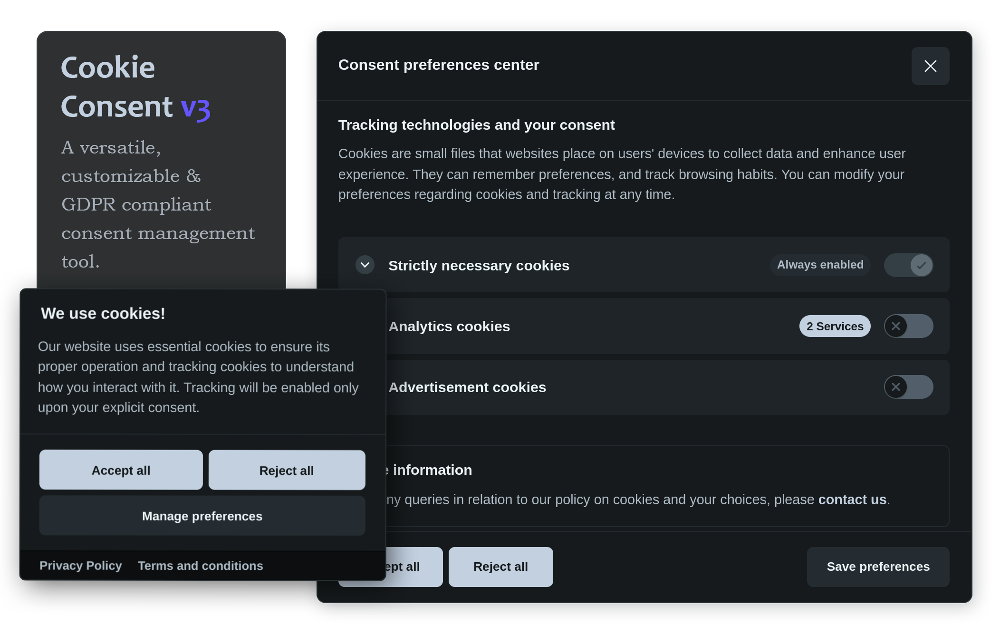

# Cookie Facile

[](https://opensource.org/licenses/MIT)
[](https://github.com/tuonome/cookie-facile/releases)

Un plugin __leggero__ e __conforme GDPR__ per la gestione del consenso cookie scritto in JavaScript vanilla.



## Demo
Prova il [playground](https://playground.cookie-facile.tuodominio.com).

## Documentazione
Documentazione disponibile su [cookie-facile.tuodominio.com](https://cookie-facile.tuodominio.com).

## Installazione

### Via NPM
```bash
npm install cookie-facile
```

### Via CDN
```html
<script src="https://cdn.jsdelivr.net/npm/cookie-facile@latest/dist/cookieconsent.umd.js"></script>
```

## Utilizzo Base
```javascript
import { CookieConsent } from 'cookie-facile';

CookieConsent.run({
    guiOptions: {
        consentModal: {
            layout: "box inline",
            position: "bottom left"
        }
    },
    language: {
        default: "it",
        translations: {
            it: {
                consentModal: {
                    title: "Utilizziamo i cookie",
                    description: "Utilizziamo i cookie per migliorare la tua esperienza di navigazione.",
                    acceptAllBtn: "Accetta tutti",
                    showPreferencesBtn: "Gestisci preferenze"
                }
            }
        }
    }
});
```

## Caratteristiche
- ✅ Conforme GDPR/CCPA
- ✅ Leggero (< 30KB)
- ✅ Zero dipendenze
- ✅ Accessibile (A11Y)
- ✅ Responsive design
- ✅ Temi personalizzabili
- ✅ Supporto multilingua
- ✅ API completa

## Deploy

### Frontend (Libreria)
Nessun server richiesto - è una libreria client-side:
- **CDN**: jsDelivr, unpkg, cdnjs
- **NPM**: `npm publish`
- **GitHub Pages**: per documentazione

### Documentazione
```bash
# Build docs
npm run docs:build

# Deploy su Netlify/Vercel/GitHub Pages
```

### Playground
```bash
cd playground
npm run build
# Deploy su hosting statico
```

## Contributing
Leggi la [guida per contribuire](/CONTRIBUTING.md).

## Licenza
Distribuito sotto licenza MIT. Vedi [LICENSE](LICENSE) per maggiori informazioni.